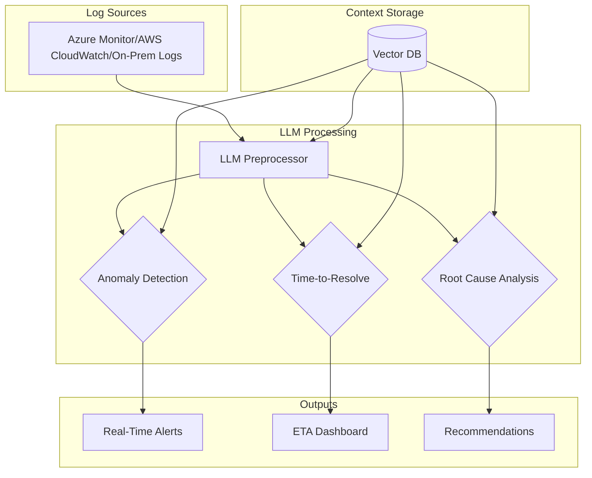

**LLM-Centric Log Monitoring Agent**, with platform-specific tooling options for Azure, AWS, and On-Prem:


# AI-Powered Log Monitoring Agent (LLM-Centric)

## Overview
A generative AI-driven solution for analyzing logs across Azure, AWS, and on-prem systems using Large Language Models (LLMs) for:
- 🚨 **Anomaly Detection**  
- ⏱️ **Time-to-Resolution Estimation**  
- 🔍 **Root Cause Analysis**  

---

## Architecture


---

## Tools by Deployment Environment

| **Component**         | **Azure**                          | **AWS**                          | **On-Prem**                     |
|-----------------------|------------------------------------|----------------------------------|---------------------------------|
| **LLM Service**       | Azure OpenAI (GPT-4)              | AWS Bedrock (Claude)             | Self-hosted Llama 3             |
| **Vector Database**   | Azure PostgreSQL + pgvector       | Amazon OpenSearch (k-NN)         | Weaviate/Pinecone               |
| **Log Ingestion**     | Azure Event Hubs                  | AWS Kinesis                      | Apache Kafka                    |
| **Orchestration**     | Azure Functions                   | AWS Lambda                       | Prefect/Airflow                 |
| **Storage**           | Azure Blob Storage                | S3                               | MinIO                           |
| **Monitoring**        | Azure Dashboard                   | CloudWatch                       | Grafana                         |
| **Alerting**          | Azure Monitor Alerts              | SNS + Lambda                     | Prometheus Alertmanager         |

---

## Workflow
1. **Log Ingestion**  
   - Azure: Event Hubs → Azure OpenAI  
   - AWS: Kinesis → Bedrock  
   - On-Prem: Kafka → Llama 3 API  

2. **LLM Processing**  
   ```python
   # Sample pseudocode
   def analyze_log(log, vector_db):
       context = vector_db.similarity_search(log)
       prompt = f"""
       Analyze this log: {log}
       Similar historical issues: {context}
       """
       return llm.invoke(prompt)
   ```

3. **Actions**  
   - Auto-trigger Azure Runbooks/AWS Systems Manager  
   - Update ServiceNow/Jira via webhooks  

---

## Benefits
- **Unified AI Layer**: Single LLM pipeline for all analysis  
- **Multi-Cloud Support**:  
  ```bash
  # Example AWS CLI for Bedrock
  aws bedrock-runtime invoke-model \
    --model-id anthropic.claude-3-sonnet \
    --body '{"prompt":"Analyze this log..."}'
  ```
- **No ML Ops Overhead**: Eliminates traditional model training  

---

## Challenges & Mitigations
| **Challenge**              | **Azure**                    | **AWS**                      | **On-Prem**               |
|----------------------------|------------------------------|------------------------------|---------------------------|
| **LLM Latency**            | Azure OpenAI Turbo models    | Bedrock streaming response   | Quantized Llama models    |
| **Data Privacy**           | Azure Private Link           | AWS PrivateLink              | Fully offline deployment  |
| **Cost Control**           | Token caps per subscription  | Bedrock pricing tiers        | Local GPU optimization    |

---

## Optimization Tips
1. **Azure**: Use [DALL-E 3](https://azure.microsoft.com/en-us/products/ai-services/openai-service) for auto-generating incident visualizations  
2. **AWS**: Combine Bedrock with CloudWatch Logs Insights  
3. **On-Prem**: Use LoRA adapters to fine-tune Llama 3 for domain-specific logs  

---
