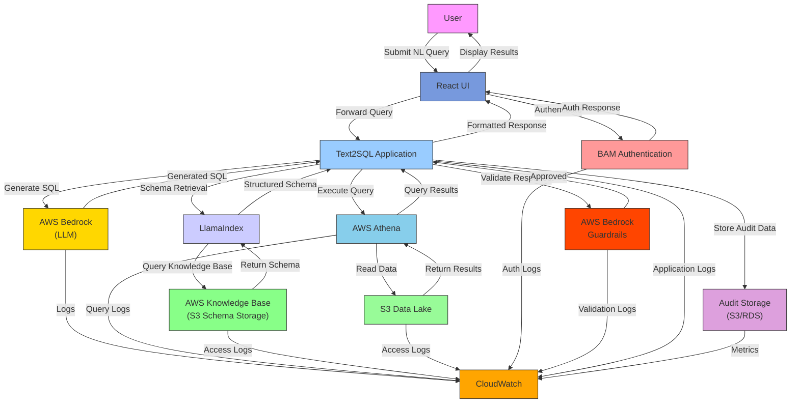

```mermaid
graph TD
    A[User] -->|Submit NL Query| B[React UI]
    B -->|Authenticate| C[BAM Authentication]
    C -->|Auth Response| B
    B -->|Forward Query| D[Text2SQL Application]
    D -->|Schema Retrieval| E[LlamaIndex]
    E -->|Query Knowledge Base| F["AWS Knowledge Base\n(S3 Schema Storage)"]
    F -->|Return Schema| E
    E -->|Structured Schema| D
    D -->|Generate SQL| G["AWS Bedrock\n(LLM)"]
    G -->|Generated SQL| D
    D -->|Validate Response| H["AWS Bedrock\nGuardrails"]
    H -->|Approved| D
    D -->|Execute Query| I["AWS Athena"]
    I -->|Read Data| J["S3 Data Lake"]
    J -->|Return Results| I
    I -->|Query Results| D
    D -->|Formatted Response| B
    B -->|Display Results| A

    D -->|Store Audit Data| K["Audit Storage\n(S3/RDS)"]
    G -->|Logs| L[CloudWatch]
    I -->|Query Logs| L
    F -->|Access Logs| L
    J -->|Access Logs| L
    C -->|Auth Logs| L
    H -->|Validation Logs| L
    D -->|Application Logs| L
    K -->|Metrics| L

    style A fill:#f9f,stroke:#333
    style B fill:#79d,stroke:#333
    style C fill:#ff9999,stroke:#333
    style D fill:#9cf,stroke:#333
    style E fill:#ccf,stroke:#333
    style F fill:#88ff88,stroke:#333
    style G fill:#ffd700,stroke:#333
    style H fill:#ff4500,stroke:#333
    style I fill:#87ceeb,stroke:#333
    style J fill:#98fb98,stroke:#333
    style K fill:#dda0dd,stroke:#333
    style L fill:#ffa500,stroke:#333
```
