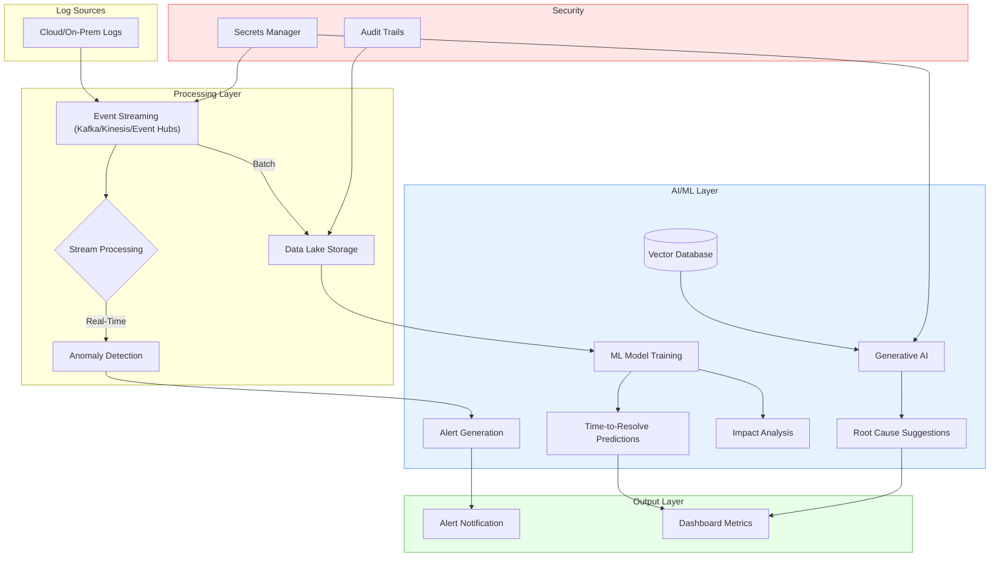

```mermaid
%% AI-Powered Log Monitoring (Cloud-Agnostic)
flowchart TD
    subgraph LogSources[Log Sources]
        A[Cloud/On-Prem Logs]
    end

    A --> B["Event Streaming (Kafka/Kinesis/Event Hubs)"]
    
    subgraph Processing[Processing Layer]
        B --> C{"Stream Processing"}
        C -->|Real-Time| D[Anomaly Detection]
        B -->|Batch| E[Data Lake Storage]
    end

    subgraph AIML[AI/ML Layer]
        D --> F[Alert Generation]
        E --> G[ML Model Training]
        G --> H[Time-to-Resolve Predictions]
        G --> I[Impact Analysis]
        J[(Vector Database)] --> K[Generative AI]
        K --> L[Root Cause Suggestions]
    end

    subgraph Output[Output Layer]
        F --> M[Alert Notification]
        H --> N[Dashboard Metrics]
        L --> N
    end

    subgraph Security[Security]
        O[Secrets Manager] --> B
        O --> K
        P[Audit Trails] --> E
    end

    style AIML fill:#e6f3ff,stroke:#4a90e2
    style Security fill:#ffe6e6,stroke:#ff4d4d
    style Output fill:#e6ffe6,stroke:#4CAF50
```
