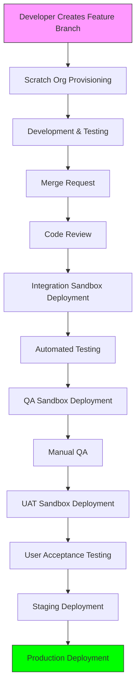
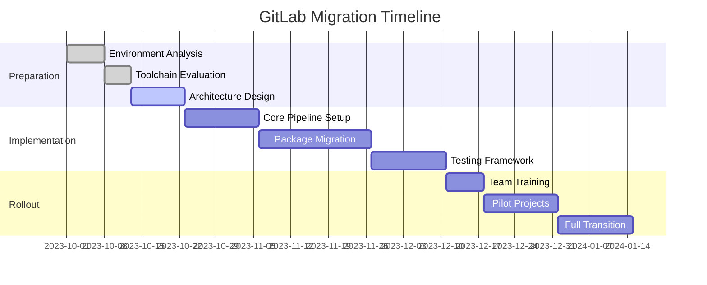

# GitLab Migration Strategy for Lumata's Salesforce DevOps

## Executive Summary

This document outlines a strategy to migrate Lumata's Salesforce DevOps pipeline from Gearset to GitLab, incorporating package-based development, infrastructure as code, and integration with existing tools while maintaining alignment with the overall DevOps vision.

## Current State Assessment

- Using Gearset with org-based development model
- Limited collaboration capabilities
- Need to transition to package-based development
- No formal AWS DevOps processes
- Desire for unified Salesforce/AWS DevOps workflows

## GitLab Migration Strategy

### 1. Repository Structure

```
lumata-sfdc/
├── .gitlab-ci.yml                 # Main CI/CD configuration
├── base-packages/                 # Core dependencies
│   ├── core/                     # Org-wide foundation
│   ├── clinical-ops/             # Business unit packages
│   └── sales/                    
├── module-packages/              # Core product IP
│   ├── enrollment/
│   └── care-management/
├── service-packages/             # Shared services
│   ├── aws-integration/
│   └── email-service/
├── unpackaged/                   # Non-packaged components
└── infrastructure/               # IaC configurations
    ├── scratch-org-defs/
    ├── sandbox-configs/
    └── aws-integration/
```

### 2. CI/CD Pipeline Architecture



### 3. Key Pipeline Stages

1. **Scratch Org Provisioning**
   - Automated creation with correct package dependencies
   - Seed data injection (non-PHI)
   - AWS test environment pairing when needed

2. **Development & Testing**
   - Local development with VS Code extensions
   - Pre-commit hooks for static analysis
   - Automated unit tests on push

3. **Merge Request Process**
   - Automated code scanning (PMD, ESLint)
   - Test coverage validation
   - Dependency impact analysis
   - Automated documentation generation

4. **Integration Phase**
   - Deployment to integration sandbox
   - Cross-package integration testing
   - AWS integration validation

5. **Quality Assurance**
   - Deployment to QA sandbox
   - Automated UI tests
   - Manual test case execution

6. **Release Process**
   - UAT validation
   - Staging deployment
   - Production promotion with feature flags

### 4. GitLab CI/CD Configuration

```yaml
stages:
  - provision
  - development
  - integration
  - qa
  - uat
  - staging
  - production

variables:
  SFDX_CLI_URL: "https://developer.salesforce.com/media/salesforce-cli/sfdx-linux-amd64.tar.xz"
  SCRATCH_ORG_DURATION: 7

provision-scratch-org:
  stage: provision
  script:
    - npm install sfdx-cli
    - sfdx force:org:create -f config/project-scratch-def.json -a ${CI_COMMIT_REF_NAME} -d ${SCRATCH_ORG_DURATION}
    - sfdx force:package:install -p "04t..." -w 10
    - sfdx force:data:tree:import -p data/seed-data.json
  only:
    - branches
  except:
    - main

run-tests:
  stage: development
  script:
    - sfdx force:apex:test:run -c -r human -w 10
    - npm run test:lwc
  needs: ["provision-scratch-org"]

deploy-integration:
  stage: integration
  script:
    - sfdx force:mdapi:deploy -u integration-org -w 10 -c
  only:
    - merge_requests

deploy-qa:
  stage: qa
  script:
    - sfdx force:mdapi:deploy -u qa-org -w 10 -c
  when: manual
  needs: ["deploy-integration"]

# Additional stages follow similar pattern
```

### 5. Migration Steps

1. **Initial Setup**
   - Create GitLab project structure
   - Configure CI/CD runners with Salesforce DX
   - Establish package version control strategy

2. **Gearset Parity Features**
   - Implement delta-based deployments
   - Create org comparison/diffing capabilities
   - Develop rollback mechanisms

3. **Advanced Capabilities**
   - Scratch org pooling implementation
   - Dynamic dependency resolution
   - Automated environment variable management

4. **Integration Layer**
   - Asana/GitLab synchronization
   - Elements.cloud integration
   - AWS/Salesforce coordination

### 6. Toolchain Recommendations

| Category          | Recommended Tools                          |
|-------------------|--------------------------------------------|
| Version Control   | GitLab                                     |
| CI/CD             | GitLab CI/CD                               |
| Package Management| Salesforce DX, SFPM                       |
| Testing           | Jest (LWC), ApexMocks (Apex), Selenium (UI)|
| Static Analysis   | PMD, ESLint, CodeScan                     |
| Documentation     | Elements.cloud, SFDX docs generation       |
| Monitoring        | GitLab Value Stream Analytics, DORA metrics|

### 7. Migration Timeline



### 8. Risk Mitigation

1. **Parallel Run Period**: Maintain Gearset during initial GitLab implementation
2. **Phased Migration**: Move packages incrementally rather than all at once
3. **Comprehensive Testing**: Implement automated testing before full transition
4. **Training Program**: Ensure all team members are proficient with new tools
5. **Rollback Plan**: Document procedures to revert if critical issues emerge

## Next Steps

1. Finalize GitLab project structure and permissions model
2. Implement core pipeline for a pilot package
3. Develop integration with Asana/Elements.cloud
4. Train development teams on new workflow
5. Establish monitoring for DORA metrics
6. Plan gradual decommissioning of Gearset

This strategy provides a comprehensive approach to migrate Lumata's Salesforce DevOps to GitLab while enabling package-based development and maintaining alignment with the broader DevOps vision. The implementation should be iterative, with continuous feedback loops to refine the process.
