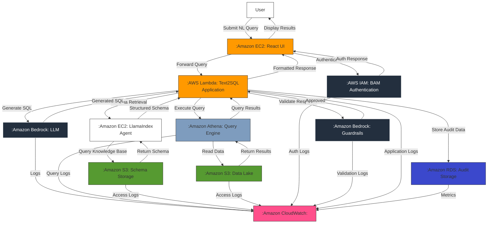

```mermaid
graph TD
    A[User] -->|Submit NL Query| B[:Amazon EC2: React UI]
    B -->|Authenticate| C[:AWS IAM: BAM Authentication]
    C -->|Auth Response| B
    B -->|Forward Query| D[:AWS Lambda: Text2SQL\nApplication]
    D -->|Schema Retrieval| E[:Amazon EC2: LlamaIndex\nAgent]
    E -->|Query Knowledge Base| F[:Amazon S3: Schema Storage]
    F -->|Return Schema| E
    E -->|Structured Schema| D
    D -->|Generate SQL| G[:Amazon Bedrock: LLM]
    G -->|Generated SQL| D
    D -->|Validate Response| H[:Amazon Bedrock: Guardrails]
    H -->|Approved| D
    D -->|Execute Query| I[:Amazon Athena: Query Engine]
    I -->|Read Data| J[:Amazon S3: Data Lake]
    J -->|Return Results| I
    I -->|Query Results| D
    D -->|Formatted Response| B
    B -->|Display Results| A

    D -->|Store Audit Data| K[:Amazon RDS: Audit Storage]
    G -->|Logs| L[:Amazon CloudWatch:]
    I -->|Query Logs| L
    F -->|Access Logs| L
    J -->|Access Logs| L
    C -->|Auth Logs| L
    H -->|Validation Logs| L
    D -->|Application Logs| L
    K -->|Metrics| L

    style A fill:#fff,stroke:#333
    style B fill:#f90,stroke:#333
    style C fill:#232F3E,stroke:#fff,color:#fff
    style D fill:#FF9900,stroke:#333
    style E fill:#fff,stroke:#333
    style F fill:#569A31,stroke:#333
    style G fill:#232F3E,stroke:#fff,color:#fff
    style H fill:#232F3E,stroke:#fff,color:#fff
    style I fill:#7E9CBE,stroke:#333
    style J fill:#569A31,stroke:#333
    style K fill:#3B48CC,stroke:#333
    style L fill:#FF4F8B,stroke:#333
```
